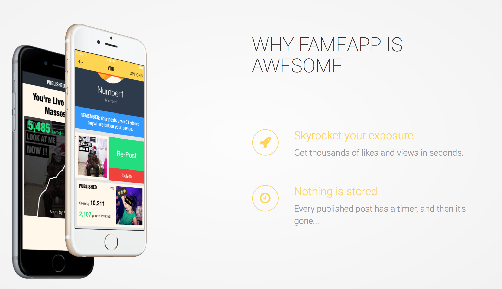

# Fame App - iOS app
http://thefameapp.co

## Namespace / Bundle Identifier
com.fameapp

## Supported Platforms
- iPhone 4+
- iOS 7.x+

## Open-Source used:
### Cocoa Pods:
- MTLog (not for production)

- AFNetworking
- INTULocationManager
- SQPersist
- IQKeyboardManager
- IQDropDownTextField
- NVDate
- UINavigationItem+Loading
- BlocksKit

- DFImageManager (with AFNetworking support)

- IQLabelView
- ABMenuTableViewCell
- WPAttributedMarkup
- KLCPopup
- DLRadioButton
- KBContactsSelection

- TOWebViewController (directly from Git)
- L360Confetti (directly from Git)

### Non-Pods:
- MaterialDesign
- GHWalkThrough
- DKStack_DKQueue
- DynamicGraphView
- ZCSlotMachine
- KKProgressTimer
- YCameraView
